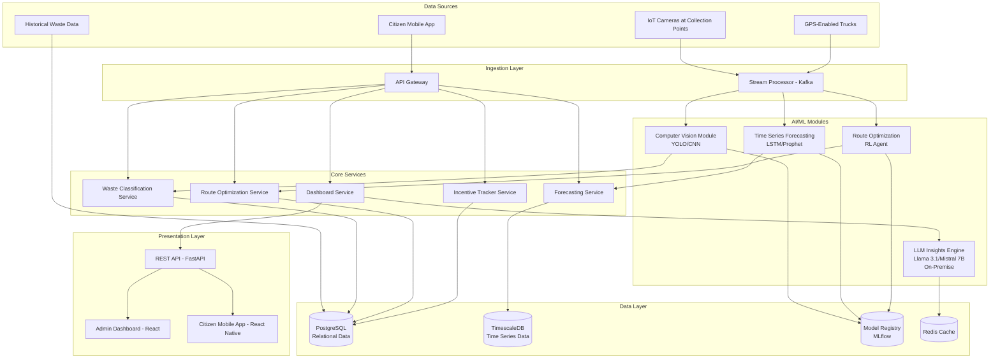
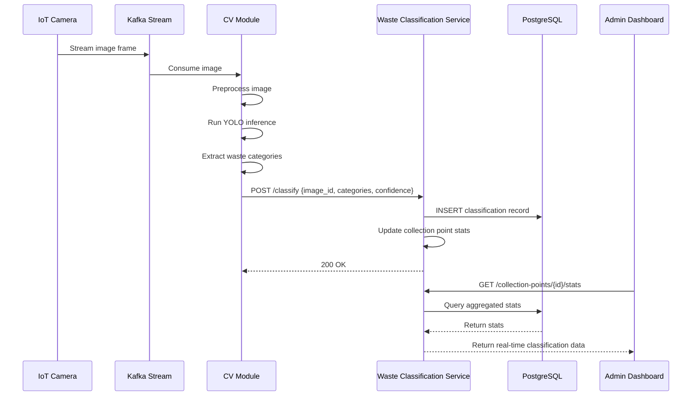
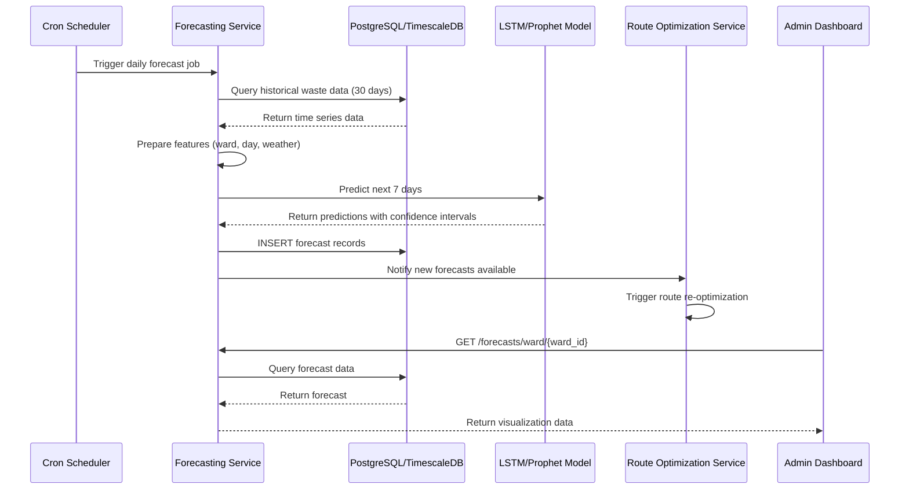
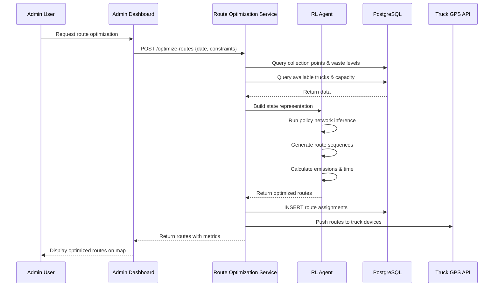
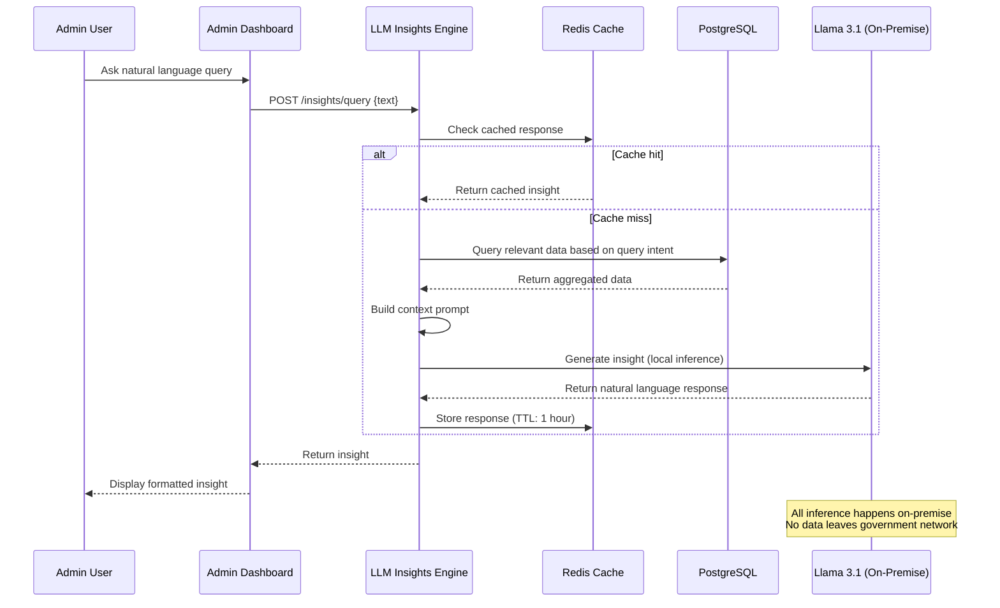

# Design Document: AI-Driven Circular Waste Intelligence System

## Overview

The AI-Driven Circular Waste Intelligence System is a comprehensive municipal waste management platform designed for the Municipal Corporation of Delhi (MCD). The system leverages computer vision, time series forecasting, route optimization, and natural language processing to transform waste management operations. It provides real-time waste classification at collection points using IoT cameras, predicts ward-wise waste generation patterns, optimizes collection routes to minimize emissions, and offers an LLM-powered dashboard for administrators to gain actionable insights. Additionally, it includes a citizen incentive tracker to encourage proper waste segregation at the source.

The system addresses critical challenges in urban waste management: inefficient collection routes leading to high fuel consumption and emissions, lack of predictive capacity for waste generation, poor waste segregation at source, and limited data-driven decision-making capabilities for administrators. By integrating multiple AI/ML modules into a unified platform, the system enables MCD to transition toward a circular economy model where waste is treated as a resource rather than a burden.

The architecture follows a microservices pattern with Python-based backend services (FastAPI), React frontend, PostgreSQL database, and real-time data pipelines for IoT camera feeds. Each AI module operates independently but shares data through a common data layer, ensuring scalability and maintainability.

## Architecture



## Sequence Diagrams

### Waste Classification Flow



### Waste Generation Forecasting Flow



### Route Optimization Flow



### LLM Insights Generation Flow



## Components and Interfaces

### Component 1: Computer Vision Module

**Purpose**: Real-time waste classification from IoT camera feeds at collection points using YOLO object detection and CNN classification.

**Interface**:
```python
from typing import List, Dict, Tuple
from dataclasses import dataclass
from enum import Enum
import numpy as np

class WasteCategory(Enum):
    ORGANIC = "organic"
    PLASTIC = "plastic"
    PAPER = "paper"
    METAL = "metal"
    GLASS = "glass"
    E_WASTE = "e_waste"
    HAZARDOUS = "hazardous"
    MIXED = "mixed"

@dataclass
class BoundingBox:
    x1: float
    y1: float
    x2: float
    y2: float
    confidence: float

@dataclass
class WasteDetection:
    category: WasteCategory
    bounding_box: BoundingBox
    confidence: float
    timestamp: float

class ComputerVisionModule:
    def __init__(self, model_path: str, device: str = "cuda"):
        """Initialize CV module with YOLO model."""
        pass
    
    def preprocess_image(self, image: np.ndarray) -> np.ndarray:
        """Preprocess image for YOLO inference."""
        pass
    
    def detect_waste(self, image: np.ndarray) -> List[WasteDetection]:
        """Detect and classify waste objects in image."""
        pass
    
    def calculate_waste_volume(self, detections: List[WasteDetection], 
                              camera_calibration: Dict) -> Dict[WasteCategory, float]:
        """Estimate waste volume from detections using camera calibration."""
        pass
    
    def update_model(self, new_model_path: str) -> bool:
        """Hot-swap model for continuous improvement."""
        pass
```

**Responsibilities**:
- Process real-time image streams from IoT cameras
- Detect waste objects using YOLO architecture
- Classify waste into 8 categories
- Estimate waste volume from 2D detections
- Support model versioning and hot-swapping
- Handle camera calibration for accurate measurements

### Component 2: Time Series Forecasting Module

**Purpose**: Predict ward-wise waste generation for next 7 days using LSTM and Prophet models.

**Interface**:
```python
from typing import List, Dict, Optional
from dataclasses import dataclass
from datetime import datetime, timedelta
import pandas as pd

@dataclass
class ForecastPoint:
    timestamp: datetime
    ward_id: str
    predicted_volume: float
    lower_bound: float
    upper_bound: float
    confidence: float

@dataclass
class HistoricalData:
    timestamp: datetime
    ward_id: str
    actual_volume: float
    weather_temp: float
    weather_humidity: float
    is_holiday: bool
    day_of_week: int

class TimeSeriesForecastingModule:
    def __init__(self, model_type: str = "lstm", lookback_days: int = 30):
        """Initialize forecasting module with LSTM or Prophet."""
        pass
    
    def prepare_features(self, historical_data: List[HistoricalData]) -> pd.DataFrame:
        """Engineer features from historical data."""
        pass
    
    def train_model(self, training_data: pd.DataFrame) -> Dict[str, float]:
        """Train forecasting model and return metrics."""
        pass
    
    def predict(self, ward_id: str, forecast_horizon: int = 7) -> List[ForecastPoint]:
        """Generate forecast for specified ward and horizon."""
        pass
    
    def evaluate_accuracy(self, predictions: List[ForecastPoint], 
                         actuals: List[float]) -> Dict[str, float]:
        """Calculate MAPE, RMSE, MAE metrics."""
        pass
    
    def detect_anomalies(self, ward_id: str, current_volume: float) -> bool:
        """Detect if current volume is anomalous."""
        pass
```

**Responsibilities**:
- Forecast waste generation 7 days ahead
- Support both LSTM and Prophet models
- Incorporate external features (weather, holidays, events)
- Provide confidence intervals for predictions
- Detect anomalies in waste generation patterns
- Retrain models weekly with new data

### Component 3: Route Optimization Module

**Purpose**: Optimize waste collection routes using reinforcement learning to minimize truck emissions and collection time.


**Interface**:
```python
from typing import List, Dict, Tuple
from dataclasses import dataclass
from enum import Enum
import numpy as np

@dataclass
class CollectionPoint:
    id: str
    latitude: float
    longitude: float
    current_fill_level: float
    predicted_fill_level: float
    waste_categories: Dict[WasteCategory, float]
    priority: int

@dataclass
class Truck:
    id: str
    capacity: float
    current_location: Tuple[float, float]
    fuel_efficiency: float
    emission_factor: float

@dataclass
class Route:
    truck_id: str
    collection_points: List[str]
    total_distance: float
    estimated_time: float
    estimated_emissions: float
    total_waste_collected: float

class RouteOptimizationModule:
    def __init__(self, rl_model_path: str, map_data_path: str):
        """Initialize RL agent and load map data."""
        pass
    
    def build_state_representation(self, 
                                   collection_points: List[CollectionPoint],
                                   trucks: List[Truck]) -> np.ndarray:
        """Build state vector for RL agent."""
        pass
    
    def optimize_routes(self, 
                       collection_points: List[CollectionPoint],
                       trucks: List[Truck],
                       constraints: Dict) -> List[Route]:
        """Generate optimized routes using RL policy."""
        pass
    
    def calculate_route_metrics(self, route: Route) -> Dict[str, float]:
        """Calculate distance, time, emissions for a route."""
        pass
    
    def update_policy(self, experiences: List[Dict]) -> Dict[str, float]:
        """Update RL policy with new experiences."""
        pass
    
    def simulate_route(self, route: Route, traffic_data: Dict) -> Dict[str, float]:
        """Simulate route execution with traffic conditions."""
        pass
```

**Responsibilities**:
- Generate optimal collection routes for truck fleet
- Minimize total emissions and collection time
- Respect truck capacity and time window constraints
- Incorporate real-time traffic data
- Support dynamic re-routing based on actual conditions
- Learn from historical route performance

### Component 4: LLM Insights Engine

**Purpose**: Provide natural language insights to administrators using open-source LLMs (Llama 3.1 or Mistral 7B) running on-premise to ensure data privacy and compliance with government security requirements.

**Interface**:
```python
from typing import List, Dict, Optional
from dataclasses import dataclass
from enum import Enum

class QueryIntent(Enum):
    WASTE_TRENDS = "waste_trends"
    ROUTE_PERFORMANCE = "route_performance"
    FORECAST_SUMMARY = "forecast_summary"
    ANOMALY_EXPLANATION = "anomaly_explanation"
    RECOMMENDATION = "recommendation"

@dataclass
class InsightQuery:
    text: str
    user_id: str
    context: Optional[Dict] = None

@dataclass
class InsightResponse:
    text: str
    intent: QueryIntent
    data_sources: List[str]
    confidence: float
    visualizations: Optional[List[Dict]] = None


class LLMInsightsEngine:
    def __init__(self, model_name: str = "llama3.1:8b", 
                 inference_backend: str = "ollama",
                 temperature: float = 0.7):
        """
        Initialize LLM engine with on-premise model.
        
        Args:
            model_name: Model identifier (llama3.1:8b, llama3.1:70b, mistral:7b)
            inference_backend: Backend for serving (ollama, vllm)
            temperature: Sampling temperature for generation
        """
        pass
    
    def classify_intent(self, query: InsightQuery) -> QueryIntent:
        """Classify user query intent."""
        pass
    
    def retrieve_relevant_data(self, intent: QueryIntent, 
                              context: Dict) -> Dict:
        """Query database for relevant data based on intent."""
        pass
    
    def build_prompt(self, query: InsightQuery, data: Dict) -> str:
        """Build context-aware prompt for LLM."""
        pass
    
    def generate_insight(self, query: InsightQuery) -> InsightResponse:
        """Generate natural language insight using on-premise LLM."""
        pass
    
    def suggest_visualizations(self, intent: QueryIntent, 
                              data: Dict) -> List[Dict]:
        """Suggest appropriate charts/graphs for insight."""
        pass
    
    def switch_model(self, model_name: str) -> bool:
        """
        Switch between Llama 3.1 and Mistral 7B based on performance needs.
        
        Args:
            model_name: Target model (llama3.1:8b, llama3.1:70b, mistral:7b)
        
        Returns:
            True if model switch successful
        """
        pass
```

**Responsibilities**:
- Parse natural language queries from administrators
- Classify query intent and retrieve relevant data
- Generate human-readable insights using on-premise LLM (Llama 3.1 or Mistral 7B)
- Suggest appropriate visualizations
- Cache frequent queries for performance
- Maintain conversation context for follow-up questions
- Ensure all inference happens on-premise with no external API calls
- Support model switching between Llama 3.1 (8B/70B) and Mistral 7B

**Data Privacy Guarantees**:
- All LLM inference runs on government-controlled infrastructure
- No data is transmitted to external APIs or cloud services
- Query logs and responses are stored locally in PostgreSQL
- Supports air-gapped deployment for maximum security

### Component 5: Incentive Tracker Service

**Purpose**: Track citizen waste segregation behavior and manage reward points.

**Interface**:
```python
from typing import List, Dict, Optional
from dataclasses import dataclass
from datetime import datetime
from enum import Enum

class IncentiveAction(Enum):
    PROPER_SEGREGATION = "proper_segregation"
    BULK_WASTE_REPORT = "bulk_waste_report"
    RECYCLING_DROP_OFF = "recycling_drop_off"
    COMMUNITY_CLEANUP = "community_cleanup"

@dataclass
class CitizenProfile:
    citizen_id: str
    name: str
    address: str
    ward_id: str
    total_points: int
    tier: str
    joined_date: datetime

@dataclass
class IncentiveEvent:
    citizen_id: str
    action: IncentiveAction
    points_earned: int
    timestamp: datetime
    verification_method: str
    metadata: Dict

class IncentiveTrackerService:
    def __init__(self, points_config: Dict):
        """Initialize incentive tracker with points configuration."""
        pass
    
    def record_action(self, event: IncentiveEvent) -> bool:
        """Record citizen action and award points."""
        pass
    
    def verify_segregation(self, citizen_id: str, 
                          image: np.ndarray) -> Tuple[bool, float]:
        """Verify waste segregation using CV module."""
        pass
    
    def calculate_tier(self, citizen_id: str) -> str:
        """Calculate citizen tier (Bronze/Silver/Gold/Platinum)."""
        pass
    
    def get_leaderboard(self, ward_id: str, limit: int = 10) -> List[CitizenProfile]:
        """Get top citizens by points in ward."""
        pass
    
    def redeem_points(self, citizen_id: str, points: int, 
                     reward_id: str) -> bool:
        """Redeem points for rewards."""
        pass
```

**Responsibilities**:
- Track citizen waste segregation actions
- Award points based on verified actions
- Verify segregation quality using CV module
- Manage citizen tiers and leaderboards
- Handle point redemption for rewards
- Generate gamification metrics

## Data Models


### Model 1: WasteClassification

```python
from sqlalchemy import Column, String, Float, DateTime, JSON, Integer, ForeignKey
from sqlalchemy.ext.declarative import declarative_base
from datetime import datetime

Base = declarative_base()

class WasteClassification(Base):
    __tablename__ = "waste_classifications"
    
    id = Column(String, primary_key=True)
    collection_point_id = Column(String, ForeignKey("collection_points.id"), nullable=False)
    image_id = Column(String, nullable=False)
    timestamp = Column(DateTime, default=datetime.utcnow, nullable=False)
    
    # Classification results
    organic_percentage = Column(Float, default=0.0)
    plastic_percentage = Column(Float, default=0.0)
    paper_percentage = Column(Float, default=0.0)
    metal_percentage = Column(Float, default=0.0)
    glass_percentage = Column(Float, default=0.0)
    e_waste_percentage = Column(Float, default=0.0)
    hazardous_percentage = Column(Float, default=0.0)
    mixed_percentage = Column(Float, default=0.0)
    
    # Metadata
    total_detections = Column(Integer, default=0)
    average_confidence = Column(Float, default=0.0)
    estimated_volume_liters = Column(Float, default=0.0)
    model_version = Column(String, nullable=False)
    detections_json = Column(JSON)  # Full detection details
```

**Validation Rules**:
- All percentage fields must sum to approximately 100.0 (±1.0 tolerance)
- average_confidence must be between 0.0 and 1.0
- estimated_volume_liters must be non-negative
- timestamp must not be in the future
- collection_point_id must reference valid collection point

### Model 2: WasteForecast

```python
class WasteForecast(Base):
    __tablename__ = "waste_forecasts"
    
    id = Column(String, primary_key=True)
    ward_id = Column(String, ForeignKey("wards.id"), nullable=False)
    forecast_date = Column(DateTime, nullable=False)
    created_at = Column(DateTime, default=datetime.utcnow, nullable=False)
    
    # Predictions
    predicted_volume_kg = Column(Float, nullable=False)
    lower_bound_kg = Column(Float, nullable=False)
    upper_bound_kg = Column(Float, nullable=False)
    confidence_score = Column(Float, nullable=False)
    
    # Features used
    temperature_celsius = Column(Float)
    humidity_percentage = Column(Float)
    is_holiday = Column(Integer, default=0)
    day_of_week = Column(Integer, nullable=False)
    
    # Model metadata
    model_type = Column(String, nullable=False)  # "lstm" or "prophet"
    model_version = Column(String, nullable=False)
    feature_importance = Column(JSON)
```

**Validation Rules**:
- predicted_volume_kg must be positive
- lower_bound_kg < predicted_volume_kg < upper_bound_kg
- confidence_score must be between 0.0 and 1.0
- day_of_week must be between 0 and 6
- humidity_percentage must be between 0 and 100
- temperature_celsius must be between -10 and 50 (Delhi climate)
- forecast_date must be in the future relative to created_at

### Model 3: OptimizedRoute

```python
class OptimizedRoute(Base):
    __tablename__ = "optimized_routes"
    
    id = Column(String, primary_key=True)
    truck_id = Column(String, ForeignKey("trucks.id"), nullable=False)
    route_date = Column(DateTime, nullable=False)
    created_at = Column(DateTime, default=datetime.utcnow, nullable=False)
    status = Column(String, default="planned")  # planned, in_progress, completed, cancelled
    
    # Route details
    collection_point_sequence = Column(JSON, nullable=False)  # Ordered list of point IDs
    total_distance_km = Column(Float, nullable=False)
    estimated_time_minutes = Column(Float, nullable=False)
    estimated_emissions_kg_co2 = Column(Float, nullable=False)
    total_waste_capacity_kg = Column(Float, nullable=False)
    
    # Actual performance (filled after completion)
    actual_distance_km = Column(Float)
    actual_time_minutes = Column(Float)
    actual_emissions_kg_co2 = Column(Float)
    actual_waste_collected_kg = Column(Float)
    
    # Optimization metadata
    rl_model_version = Column(String, nullable=False)
    optimization_score = Column(Float, nullable=False)
    constraints_json = Column(JSON)
```

**Validation Rules**:
- total_distance_km must be positive
- estimated_time_minutes must be positive and < 480 (8 hour shift)
- estimated_emissions_kg_co2 must be non-negative
- total_waste_capacity_kg must not exceed truck capacity
- collection_point_sequence must contain at least 2 points
- status must be one of: planned, in_progress, completed, cancelled
- optimization_score must be between 0.0 and 1.0
- If status is "completed", actual_* fields must be populated

### Model 4: CitizenIncentive

```python
class CitizenIncentive(Base):
    __tablename__ = "citizen_incentives"
    
    id = Column(String, primary_key=True)
    citizen_id = Column(String, ForeignKey("citizens.id"), nullable=False)
    action_type = Column(String, nullable=False)
    points_earned = Column(Integer, nullable=False)
    timestamp = Column(DateTime, default=datetime.utcnow, nullable=False)
    
    # Verification
    verification_method = Column(String, nullable=False)  # cv_verified, manual, qr_scan
    verification_confidence = Column(Float)
    verification_image_id = Column(String)
    
    # Metadata
    location_lat = Column(Float)
    location_lon = Column(Float)
    metadata_json = Column(JSON)
```

**Validation Rules**:
- points_earned must be positive
- action_type must be one of: proper_segregation, bulk_waste_report, recycling_drop_off, community_cleanup
- verification_method must be one of: cv_verified, manual, qr_scan
- If verification_method is "cv_verified", verification_confidence must be between 0.0 and 1.0
- timestamp must not be in the future


### Model 5: CollectionPoint

```python
class CollectionPoint(Base):
    __tablename__ = "collection_points"
    
    id = Column(String, primary_key=True)
    name = Column(String, nullable=False)
    ward_id = Column(String, ForeignKey("wards.id"), nullable=False)
    latitude = Column(Float, nullable=False)
    longitude = Column(Float, nullable=False)
    
    # Capacity
    max_capacity_liters = Column(Float, nullable=False)
    current_fill_level_percentage = Column(Float, default=0.0)
    
    # IoT
    camera_id = Column(String)
    sensor_id = Column(String)
    last_updated = Column(DateTime, default=datetime.utcnow)
    
    # Status
    is_active = Column(Integer, default=1)
    priority_level = Column(Integer, default=1)  # 1-5, 5 being highest
```

**Validation Rules**:
- latitude must be between 28.4 and 28.9 (Delhi bounds)
- longitude must be between 76.8 and 77.4 (Delhi bounds)
- max_capacity_liters must be positive
- current_fill_level_percentage must be between 0.0 and 100.0
- priority_level must be between 1 and 5
- is_active must be 0 or 1

## Algorithmic Pseudocode

### Main Waste Classification Algorithm

```python
def classify_waste_from_stream(image_stream, model, camera_calibration):
    """
    Main algorithm for real-time waste classification from IoT camera stream.
    
    Preconditions:
    - image_stream is a valid video stream from IoT camera
    - model is a loaded YOLO model with weights
    - camera_calibration contains valid calibration parameters
    
    Postconditions:
    - Returns classification results for each frame
    - All detections have confidence >= threshold
    - Volume estimates are non-negative
    
    Loop Invariants:
    - All processed frames maintain temporal ordering
    - Detection confidence threshold remains constant
    """
    CONFIDENCE_THRESHOLD = 0.5
    FRAME_SKIP = 3  # Process every 3rd frame for efficiency
    
    frame_count = 0
    results = []
    
    while image_stream.is_active():
        frame = image_stream.read_frame()
        frame_count += 1
        
        # Skip frames for efficiency
        if frame_count % FRAME_SKIP != 0:
            continue
        
        # Preprocess
        preprocessed = preprocess_image(frame)
        assert preprocessed.shape == (640, 640, 3), "Invalid preprocessing"
        
        # Run inference
        detections = model.predict(preprocessed)
        
        # Filter by confidence
        filtered_detections = []
        for detection in detections:
            if detection.confidence >= CONFIDENCE_THRESHOLD:
                filtered_detections.append(detection)
        
        # Calculate waste composition
        category_counts = {}
        for detection in filtered_detections:
            category = detection.category
            category_counts[category] = category_counts.get(category, 0) + 1
        
        total_detections = len(filtered_detections)
        if total_detections > 0:
            percentages = {
                cat: (count / total_detections) * 100 
                for cat, count in category_counts.items()
            }
            
            # Estimate volume
            volume = estimate_volume_from_detections(
                filtered_detections, 
                camera_calibration
            )
            
            result = {
                "timestamp": frame.timestamp,
                "detections": filtered_detections,
                "percentages": percentages,
                "estimated_volume": volume,
                "confidence": sum(d.confidence for d in filtered_detections) / total_detections
            }
            
            results.append(result)
            
            # Persist to database
            save_classification_to_db(result)
    
    return results
```

**Preconditions**:
- image_stream is connected and streaming valid frames
- model is loaded with valid YOLO weights
- camera_calibration contains focal_length, sensor_size, distance_to_ground

**Postconditions**:
- All returned results have timestamp in chronological order
- All detections meet minimum confidence threshold
- Volume estimates are physically plausible (> 0, < max_capacity)


**Loop Invariants**:
- frame_count is monotonically increasing
- All results maintain temporal ordering
- CONFIDENCE_THRESHOLD remains constant throughout execution

### Waste Generation Forecasting Algorithm

```python
def forecast_waste_generation(ward_id, forecast_horizon_days, historical_data, model):
    """
    Generate waste generation forecast using LSTM or Prophet model.
    
    Preconditions:
    - ward_id is a valid ward identifier
    - forecast_horizon_days is between 1 and 30
    - historical_data contains at least 30 days of data
    - model is trained and ready for inference
    
    Postconditions:
    - Returns forecast_horizon_days predictions
    - Each prediction has confidence interval
    - Predictions are non-negative
    
    Loop Invariants:
    - All generated predictions maintain chronological order
    - Feature vectors have consistent dimensionality
    """
    LOOKBACK_DAYS = 30
    FEATURE_DIM = 10
    
    # Validate inputs
    assert forecast_horizon_days >= 1 and forecast_horizon_days <= 30
    assert len(historical_data) >= LOOKBACK_DAYS
    
    # Prepare features
    features = []
    for i in range(len(historical_data) - LOOKBACK_DAYS + 1):
        window = historical_data[i:i + LOOKBACK_DAYS]
        
        # Extract time series features
        feature_vector = extract_features(window)
        assert len(feature_vector) == FEATURE_DIM
        
        features.append(feature_vector)
    
    # Generate forecasts
    forecasts = []
    current_date = historical_data[-1].date
    
    for day in range(forecast_horizon_days):
        target_date = current_date + timedelta(days=day + 1)
        
        # Get external features for target date
        weather = get_weather_forecast(target_date)
        is_holiday = check_holiday_calendar(target_date)
        day_of_week = target_date.weekday()
        
        # Build input tensor
        input_features = build_input_tensor(
            features[-1],  # Last known features
            weather,
            is_holiday,
            day_of_week
        )
        
        # Run model inference
        if model.type == "lstm":
            prediction, std_dev = model.predict_with_uncertainty(input_features)
        else:  # Prophet
            prediction, lower, upper = model.predict(input_features)
            std_dev = (upper - lower) / 4  # Approximate std dev from CI
        
        # Calculate confidence interval (95%)
        lower_bound = max(0, prediction - 1.96 * std_dev)
        upper_bound = prediction + 1.96 * std_dev
        
        # Calculate confidence score based on prediction stability
        confidence = calculate_confidence_score(prediction, std_dev, historical_data)
        
        forecast = {
            "date": target_date,
            "ward_id": ward_id,
            "predicted_volume": prediction,
            "lower_bound": lower_bound,
            "upper_bound": upper_bound,
            "confidence": confidence,
            "features": {
                "temperature": weather.temperature,
                "humidity": weather.humidity,
                "is_holiday": is_holiday,
                "day_of_week": day_of_week
            }
        }
        
        forecasts.append(forecast)
        
        # Update features for next iteration
        features.append(update_feature_vector(features[-1], forecast))
    
    # Persist forecasts
    save_forecasts_to_db(forecasts)
    
    return forecasts
```

**Preconditions**:
- ward_id exists in wards table
- 1 <= forecast_horizon_days <= 30
- len(historical_data) >= 30
- model is trained with validation loss < threshold
- All historical_data entries have required fields

**Postconditions**:
- len(forecasts) == forecast_horizon_days
- All predictions are non-negative
- For each forecast: lower_bound < predicted_volume < upper_bound
- All confidence scores are between 0.0 and 1.0
- Forecasts are saved to database

**Loop Invariants**:
- All forecasts maintain chronological order (date[i] < date[i+1])
- Feature vector dimensionality remains FEATURE_DIM
- All predictions are physically plausible (>= 0)

### Route Optimization Algorithm (Reinforcement Learning)

```python
def optimize_collection_routes(collection_points, trucks, constraints, rl_agent):
    """
    Optimize waste collection routes using RL agent to minimize emissions.
